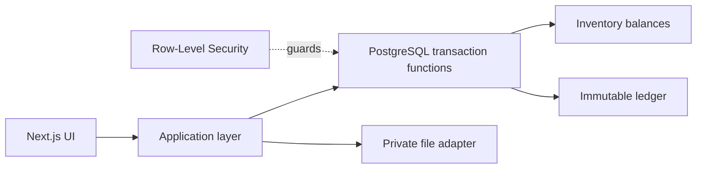

# Store-Isolated Inventory System

[](https://github.com/ChenHuang-debug/store-isolated-inventory-system/actions/workflows/ci.yml)

一个面向小型运营与仓库团队的中文库存工作台。项目重点不是简单维护余额，而是用 PostgreSQL 事务、行级安全策略和不可变流水保证多店铺数据隔离、批量入账一致性与完整审计。

> 这是经过脱敏的作品集版本。店铺、账号、供应商、SKU、库存数量和基础设施信息均为合成或通用示例；不包含生产数据、密钥、真实域名或部署配置。

## 核心能力

- 多店铺隔离：应用层授权、查询条件、复合外键与 PostgreSQL RLS 四层防护
- 原子库存：到仓待入、实点入库、整批出库和库存纠错均通过事务函数完成
- 幂等与并发：重复请求只入账一次，库存不足时整批回滚且不产生负库存
- Excel 工作流：中文模板、服务端解析、预览校验、文件哈希去重和原文件追溯
- 安全认证：Argon2id 密码哈希、哈希会话令牌、登录限流与 TOTP 双重验证
- 审计追踪：记录店铺、SKU、批次、操作人、时间、前后数量和差异原因

## 技术栈

- Next.js 16、React 19、TypeScript strict mode、Tailwind CSS
- PostgreSQL 17、SQL migrations、Row-Level Security
- Vitest、PostgreSQL integration tests
- ExcelJS、Zod、Argon2id
- Docker Compose（仅本地依赖）

## 项目结构

```text
app/                 Next.js 页面、Server Actions 与 Route Handlers
lib/                 认证、数据库、Excel 与店铺上下文
db/migrations/       Schema、RLS、约束和原子库存函数
scripts/             环境检查、迁移、管理员与 MFA 初始化
tests/               单元测试和 PostgreSQL 集成测试
docs/                架构、数据模型和安全设计
.github/workflows/   持续集成
```

## 本地运行

要求：Node.js 24、npm、Docker Desktop。

```bash
npm ci
cp .env.example .env.local
```

将 `.env.local` 中的示例密码和 `SESSION_SECRET` 换成随机值，并让 `POSTGRES_PASSWORD` 与迁移连接串中的密码一致，然后运行：

```bash
docker compose up -d
npm run db:wait
npm run db:migrate
npm run db:setup
npm run admin:init
npm run dev
```

浏览器访问 `http://127.0.0.1:3000`。管理员密码只在交互式命令中输入，不应写入文件或终端历史。

## 验证

```bash
npm run check:env
npm run lint
npm run typecheck
npm test
npm run build
```

集成测试覆盖 RLS 越权、跨店外键、幂等重放、并发出库、整批回滚、Excel 重复导入和 MFA 数据库约束。

## 关键设计



- [架构说明](docs/architecture.md)
- [数据模型](docs/data-model.md)
- [安全模型](docs/security-model.md)

## 公开范围

该仓库用于技术作品展示和评审，不代表任何线上环境，也不授予生产系统、数据或基础设施的访问权限。当前未附开源许可证，因此默认保留全部权利；如需复用，请先取得作者书面许可。
