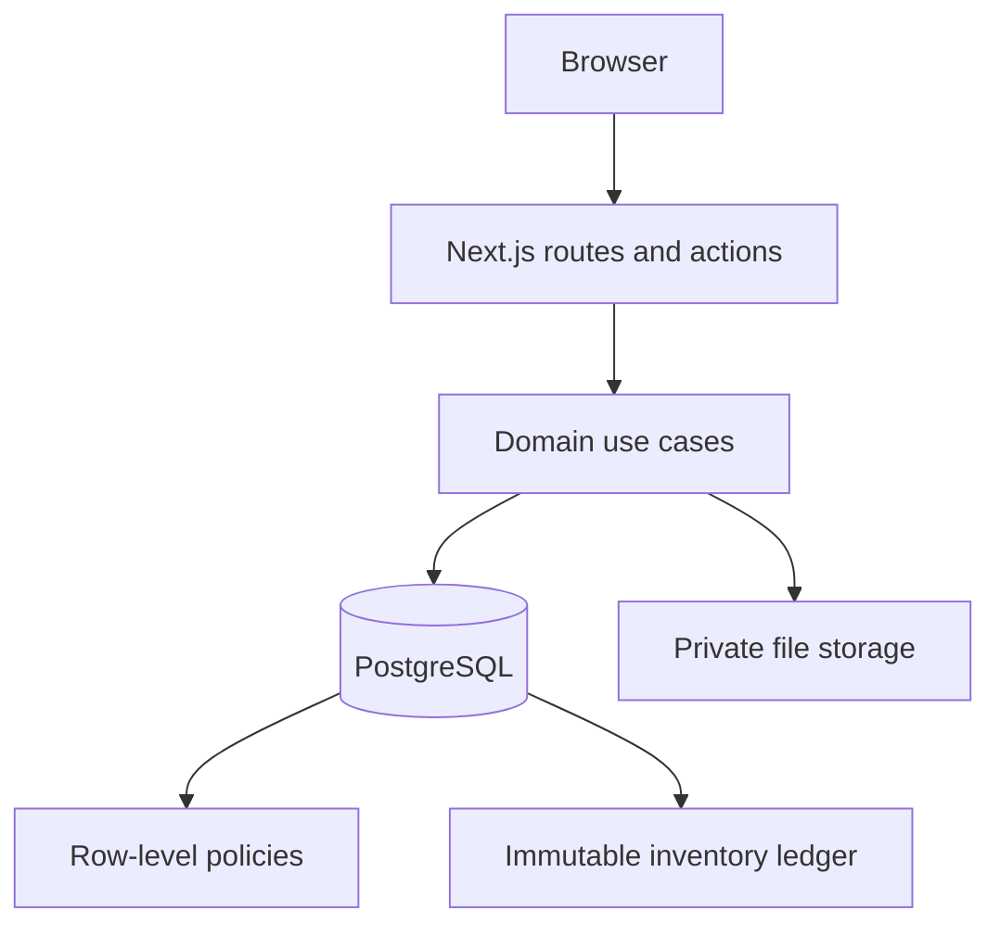

# Architecture

## 模块边界

系统采用模块化单体。浏览器只负责交互，权限和业务不变量在服务端与数据库重复校验。

| 层 | 责任 |
| --- | --- |
| UI | 中文工作流、输入反馈、预览与筛选 |
| Application | 会话、权限、输入验证、幂等键和用例编排 |
| Database | 事务、锁、RLS、跨店约束和库存不变量 |
| Integrations | Excel、文件存储与邮件适配器 |

## 库存写入路径

1. 验证会话、店铺权限、业务输入和幂等键。
2. 按稳定顺序锁定涉及的库存行。
3. 在同一事务内重新核验库存、更新余额并追加流水。
4. 任一行失败时回滚整个批次。
5. 重复幂等键返回首次结果，不重复改变库存。

余额用于查询性能，不是唯一事实来源；不可变流水保留每次变化的前值、后值、原因、操作者与批次。

## 环境边界

公开仓库只提供本地开发拓扑。数据库和 Mailpit 绑定回环地址，上传目录被 Git 忽略。生产部署、真实域名、网络策略、备份位置和云资源标识不属于公开版本。
